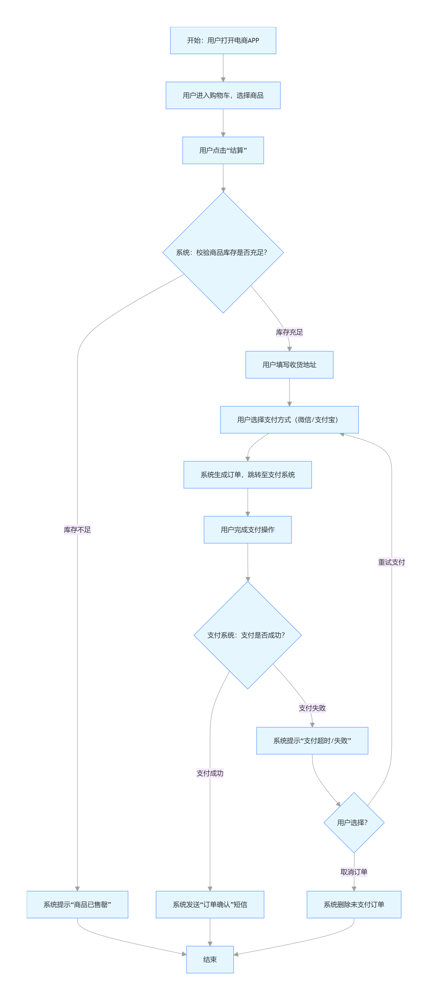

# 场景流程图：概念、要素、绘制方法与实践指南

场景流程图（Scenario Flow Chart）是**聚焦特定业务场景或用户行为**的可视化工具，通过标准化符号和逻辑连线，清晰呈现 “谁（参与者）在什么条件下，按什么顺序完成什么动作，最终达成什么结果”。它区别于通用流程图，更强调 “场景化”—— 即围绕一个具体目标（如 “用户线上下单付款”“设备故障排查”）展开，突出流程中的关键节点、判断条件和异常分支，帮助团队对齐认知、优化流程或排查问题。

## 一、场景流程图的核心价值

在业务梳理、产品设计、运维管理、项目协作等场景中，场景流程图是高效沟通的 “通用语言”，核心价值包括：

1. **对齐认知** ：避免 “各说各话”—— 例如产品经理、开发、测试对 “用户注册流程” 的理解差异，通过流程图可明确 “是否需要手机验证码”“注册失败后如何重试” 等细节。
2. **优化流程** ：直观暴露冗余或断点 —— 例如绘制 “客服处理投诉流程” 时，发现 “用户信息需重复录入 3 次”，可针对性简化。
3. **降低沟通成本** ：替代冗长文字描述 —— 用 1 张图说明 “电商下单全流程”，比 500 字文字更易理解，尤其适合跨部门协作。
4. **沉淀知识资产** ：将隐性流程显性化 —— 例如老员工的 “服务器故障应急处理经验”，通过流程图转化为可复用的标准操作手册（SOP）。

## 二、场景流程图与普通流程图的区别

很多人会混淆 “场景流程图” 与 “通用流程图”，二者核心差异在于 **“聚焦范围” 和 “颗粒度”**，具体对比如下：

| 对比维度 | 场景流程图                                             | 普通流程图（如程序流程图、业务流程图）                    |
| -------- | ------------------------------------------------------ | --------------------------------------------------------- |
| 适用范围 | 聚焦**单一具体场景** （如 “用户忘记密码找回”） | 覆盖**通用 / 整体流程** （如 “整个用户账号体系”） |
| 核心要素 | 强调 “参与者”“场景条件”“异常分支”                | 强调 “步骤”“逻辑关系”（如顺序、循环、判断）           |
| 颗粒度   | 中等（不冗余、不遗漏关键节点）                         | 可粗可细（如程序流程图需细化到 “变量赋值”）             |
| 目标导向 | 解决 “特定场景的逻辑闭环”（如 “支付失败怎么办”）   | 解决 “整体流程的逻辑通顺”（如 “从注册到登录”）        |
| 典型示例 | 外卖订单 “申请退款→商家审核→平台打款” 流程         | 公司 “员工入职从 offer 发放到转正” 全流程               |

## 三、场景流程图的核心组成要素（含符号规范）

绘制场景流程图需遵循标准化符号（避免自定义符号导致误解），核心要素及常用符号如下：

| 要素名称           | 核心作用                                           | 常用符号（及说明）                                               |
| ------------------ | -------------------------------------------------- | ---------------------------------------------------------------- |
| 1. 参与者          | 明确 “谁在执行动作”（人、系统、设备等）          | 矩形（内部标注角色 / 系统名，如 “用户”“支付系统”）           |
| 2. 起始 / 结束节点 | 标记流程的 “开始点” 和 “结束点”                | 椭圆（起始节点标注 “开始”，结束节点标注 “结束 / 完成”）      |
| 3. 动作节点        | 描述 “具体执行的操作”（需动词 + 名词结构）       | 矩形（如 “用户输入手机号”“系统验证验证码”）                  |
| 4. 判断节点        | 表示 “流程分支的条件判断”（需有 2 个及以上分支） | 菱形（内部标注判断条件，如 “验证码是否正确？”）                |
| 5. 流程线          | 连接各节点，指示 “流程走向”                      | 带箭头的直线（箭头方向 = 流程方向，避免交叉）                    |
| 6. 分支 / 合并节点 | 处理 “多路径并行” 或 “多路径汇总”              | 分支：从判断节点延伸多条流程线；合并：多条流程线汇入同一动作节点 |
| 7. 异常节点        | 标记 “流程异常或错误处理”（如失败、重试）        | 虚线矩形 +“⚠️” 符号（如 “验证码错误→提示用户重新输入”）   |
| 8. 备注 / 说明     | 补充节点的额外信息（如 “超时时间 5 分钟”）       | 虚线连接的矩形（标注 “备注：XXX”）                             |

## 四、场景流程图的绘制步骤（以 “电商用户下单付款” 为例）

绘制需遵循 “先明确目标→再梳理逻辑→最后可视化” 的流程，避免直接上手画图导致逻辑混乱。以下是具体步骤：

### 步骤 1：明确场景目标与边界（避免流程 “发散”）

首先回答 3 个问题，锁定场景范围：

* **谁参与** ：用户、电商平台系统、支付系统、库存系统；
* **做什么** ：用户从 “加入购物车” 到 “支付成功” 的全流程；
* **不包含什么** ：排除 “支付后发货”“售后退款”（避免流程过长）。

> 示例目标：清晰呈现 “用户在电商 APP 下单并完成支付” 的正常流程与异常分支（如支付失败、库存不足）。

### 步骤 2：梳理核心流程节点（按 “时间线 / 用户行为线” 拆解）

用 “列表法” 先列出所有关键节点，避免遗漏，按 “用户动作→系统响应” 的顺序排列：

1. 用户：打开电商 APP→进入购物车→选择商品→点击 “结算”；
2. 系统：校验商品库存（判断 “库存是否充足”）；
3. 若库存充足：用户填写收货地址→选择支付方式（微信 / 支付宝）；
4. 系统：生成订单→跳转至支付系统；
5. 用户：完成支付（判断 “支付是否成功”）；
6. 若支付成功：系统发送 “订单确认” 短信→流程结束；
7. 若支付失败：系统提示 “支付超时 / 失败”→用户可选择 “重试支付” 或 “取消订单”。

### 步骤 3：拆解判断条件与异常分支（避免 “只画正常流程”）

场景流程图的核心价值是 “覆盖异常”，需针对每个可能的分支补充逻辑：

* **判断 1：商品库存是否充足**
  * 分支 A（充足）：进入结算页面；
  * 分支 B（不足）：系统提示 “商品已售罄”→流程结束；
* **判断 2：支付是否成功**
  * 分支 A（成功）：订单确认；
  * 分支 B（失败）：提示用户 “重试” 或 “取消”（取消则流程结束，重试则回到 “选择支付方式”）。

### 步骤 4：选择工具绘制并优化（遵循 “简洁、易懂” 原则）

1. **选择工具** ：根据需求选择（详见下文 “工具推荐”），新手推荐用 Draw.io（免费、在线、符号齐全）；
2. **绘制逻辑** ：

* 从 “起始节点”（用户打开 APP）开始，按顺序摆放节点；
* 判断节点的分支用 “流程线 + 文字标注”（如 “库存充足→”“库存不足→”）；
* 异常节点用虚线标注（如 “支付失败→⚠️提示重试”）；

1. **优化细节** ：

* 避免流程线交叉（可调整节点位置）；
* 节点文字简洁（如 “用户填写收货地址” 而非 “用户在页面上找到收货地址栏并填写详细信息”）；
* 统一符号（如所有判断节点用菱形，不混用其他形状）。

### 步骤 5：评审与确认（确保流程 “闭环且无逻辑漏洞”）

邀请场景相关方（如产品、开发、客服）评审，重点确认：

* 是否有遗漏的节点（如 “是否需要校验用户登录状态？”）；
* 异常分支是否闭环（如 “支付失败后，用户取消订单，系统是否需要删除未支付订单？”）；
* 术语是否统一（如 “‘订单生成’和‘下单’是否指同一动作”）。

## 五、场景流程图的适用场景（附示例方向）

场景流程图几乎适用于所有需要 “梳理逻辑、对齐认知” 的场景，以下是典型应用领域及示例：

| 应用领域 | 典型场景示例                                          | 核心价值                                                        |
| -------- | ----------------------------------------------------- | --------------------------------------------------------------- |
| 产品设计 | APP 用户 “忘记密码→验证码找回” 流程                | 明确 “验证码有效期”“找回失败后的重试次数”，避免产品逻辑漏洞 |
| 电商业务 | “用户下单→支付→取消订单→退款” 流程               | 对齐运营、开发、客服对 “退款到账时间” 的认知                  |
| 运维管理 | “服务器 CPU 利用率过高→故障排查→恢复正常” 流程    | 转化为 SOP，新运维人员可快速上手                                |
| 客户服务 | “用户投诉→客服记录→工单分配→问题解决→回访” 流程 | 暴露 “工单分配耗时过长” 的问题，优化效率                      |
| 项目协作 | “需求评审→开发→测试→上线→灰度验证” 流程         | 明确各角色的节点责任（如 “测试需在开发完成后 2 天内完成”）    |

## 六、场景流程图绘制工具推荐（按 “易用性 + 功能” 分类）

不同工具适用于不同需求，以下是主流工具对比：

| 工具名称        | 类型                 | 核心特点                                                             | 适用人群                                     |
| --------------- | -------------------- | -------------------------------------------------------------------- | -------------------------------------------- |
| Draw.io         | 在线免费             | 符号齐全（支持场景流程图、UML 等）、可导出 PNG/PDF、无广告           | 新手、个人、小团队（无需安装，浏览器直接用） |
| ProcessOn       | 在线付费（有免费版） | 支持多人实时协作、模板丰富（含电商、运维等场景模板）                 | 跨部门协作团队（需共享编辑）                 |
| Microsoft Visio | 桌面付费             | 功能强大、可与 Office 联动、支持复杂流程绘制                         | 企业级用户、需绘制复杂场景（如多系统交互）   |
| Axure RP        | 桌面付费             | 可结合原型设计（绘制 “流程 + 界面原型”）、支持交互                 | 产品经理（需将流程与产品界面结合）           |
| Mermaid         | 代码生成             | 用文本代码生成流程图（如 `flowchart TD A[开始]→B`）、支持嵌入文档 | 程序员、技术文档作者（习惯用代码描述逻辑）   |

## 七、绘制场景流程图的注意事项（避坑指南）

1. **避免 “过度细节化”** ：无需绘制 “用户点击某个按钮→页面跳转” 这类细碎步骤，重点保留 “影响流程走向” 的关键节点（如 “选择支付方式” 是关键，“点击支付按钮” 不是）。
2. **明确 “节点责任方”** ：每个动作节点需标注 “谁执行”（如 “系统校验库存” 而非 “校验库存”），避免责任模糊。
3. **必须覆盖 “异常分支”** ：只画 “正常流程” 的流程图毫无意义，需至少包含 2-3 个核心异常（如 “支付失败”“库存不足”“网络超时”）。
4. **保持 “符号与术语统一”** ：团队内部约定符号规范（如 “异常节点统一用虚线”），术语统一（如 “‘下单’和‘创建订单’统一为后者”）。
5. **避免 “流程线交叉”** ：交叉的流程线会严重影响可读性，可通过调整节点位置、使用 “流程线跳转标记”（如用 “A→B” 标注跨页流程）解决。

## 八、示例：电商用户 “下单付款” 场景流程图（Mermaid 代码 + 可视化效果）

以下用 Mermaid 代码绘制核心流程，可直接复制到 Mermaid 编辑器（如[Mermaid Live Editor](https://mermaid.live/)）生成可视化图表：

### 可视化效果说明：

* 起始节点（A）→ 用户动作（B、C、F、G、I）→ 系统判断（D、J、M）→ 正常分支（K→结束）→ 异常分支（E→结束、L→重试 / 取消）；
* 所有判断节点（菱形）均有明确分支，异常流程（支付失败、库存不足）均闭环，无 “断流”。

## 总结

场景流程图的核心是 “ **围绕具体场景，讲清逻辑闭环** ”—— 它不需要复杂的符号或冗余的细节，而是通过 “参与者 + 动作 + 判断 + 异常” 的组合，让复杂流程变得直观易懂。无论是产品设计、业务梳理还是团队协作，掌握场景流程图的绘制方法，都能显著提升沟通效率和流程优化能力。
